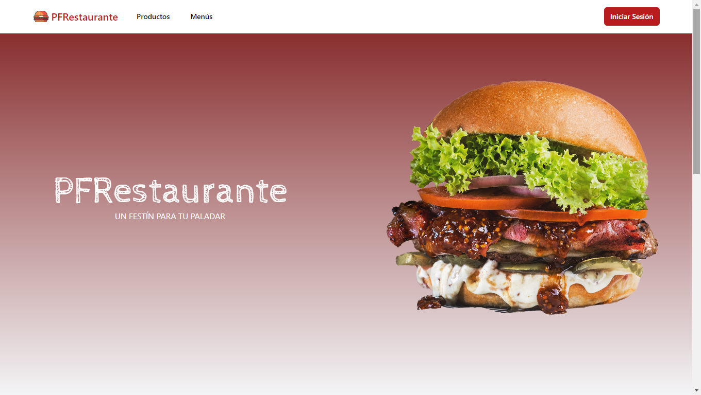
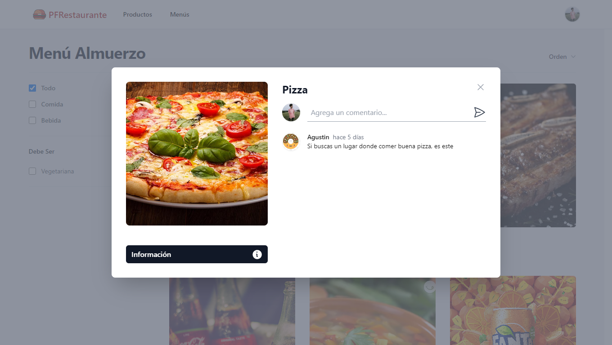
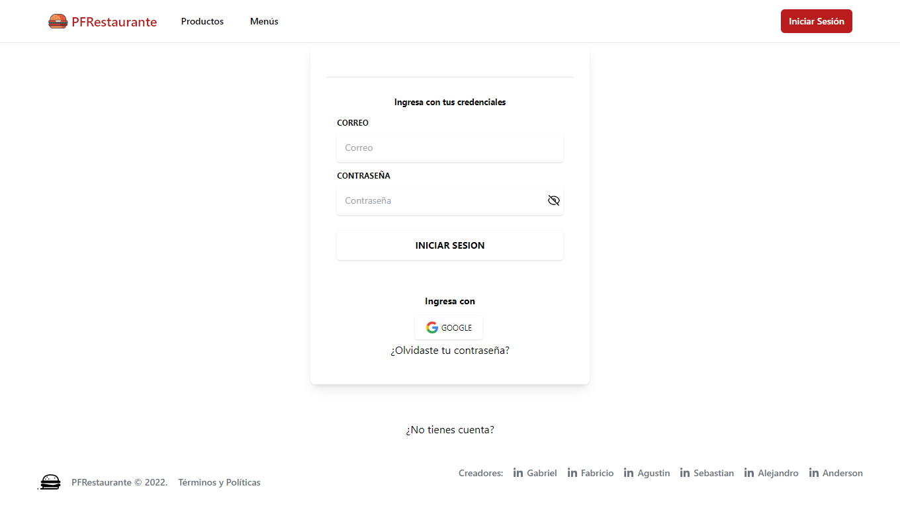
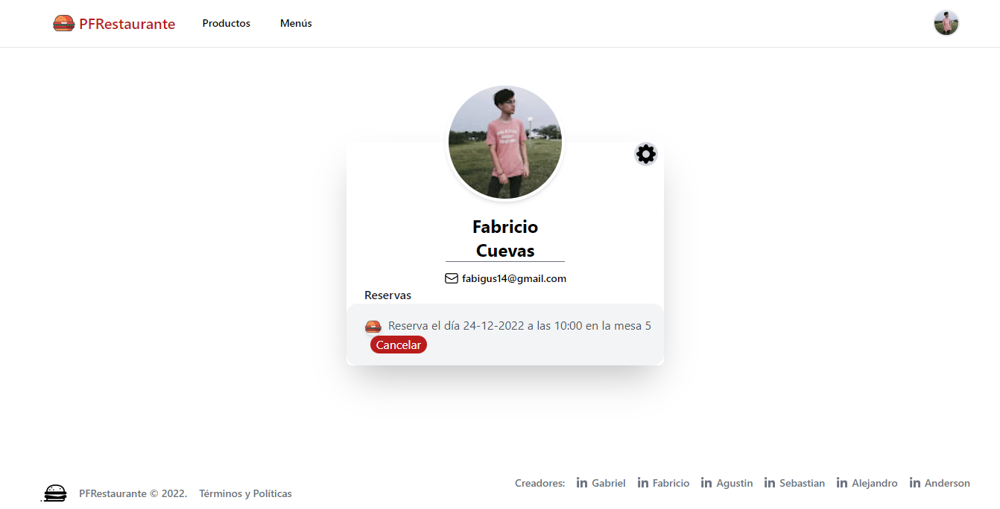
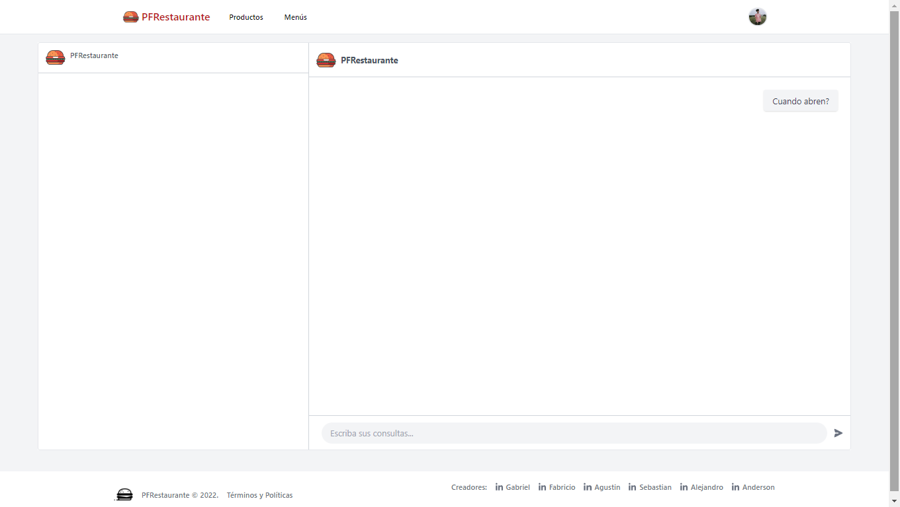
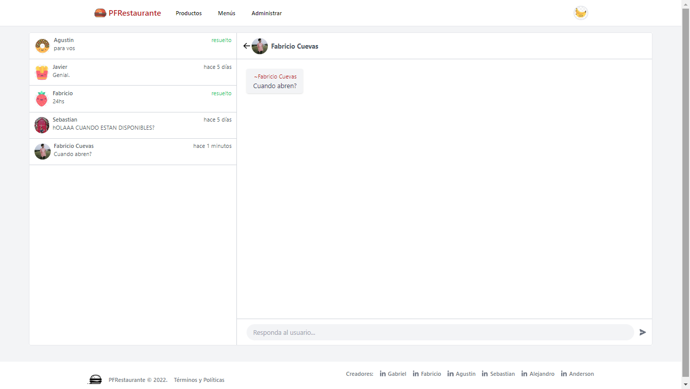
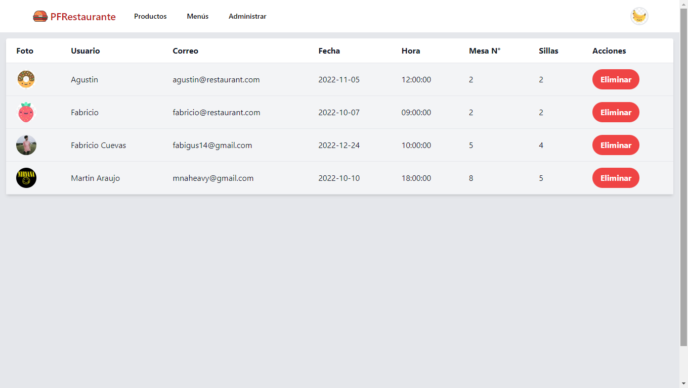
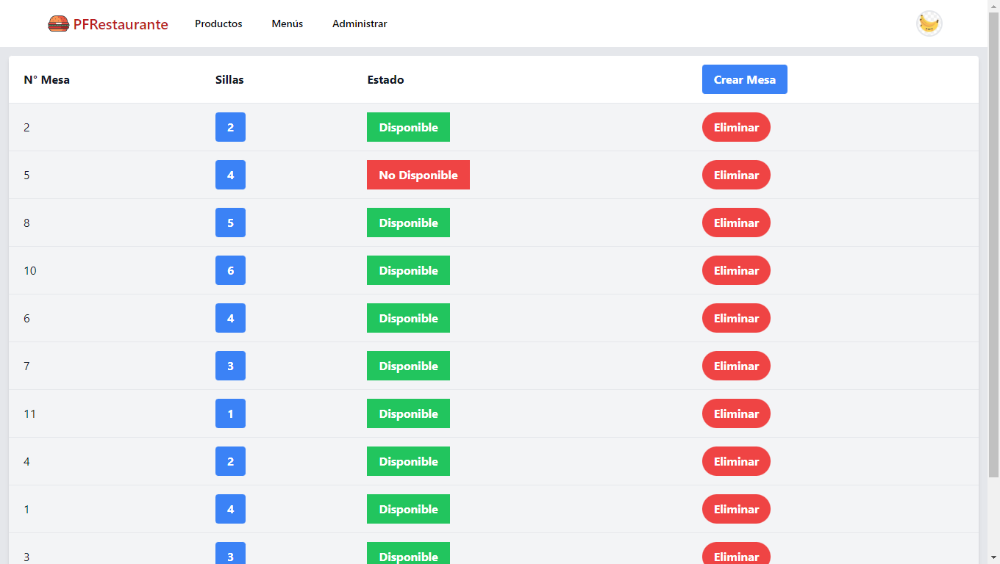
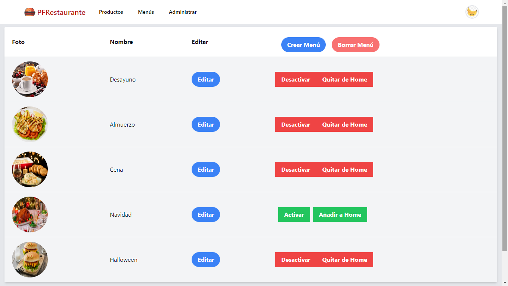
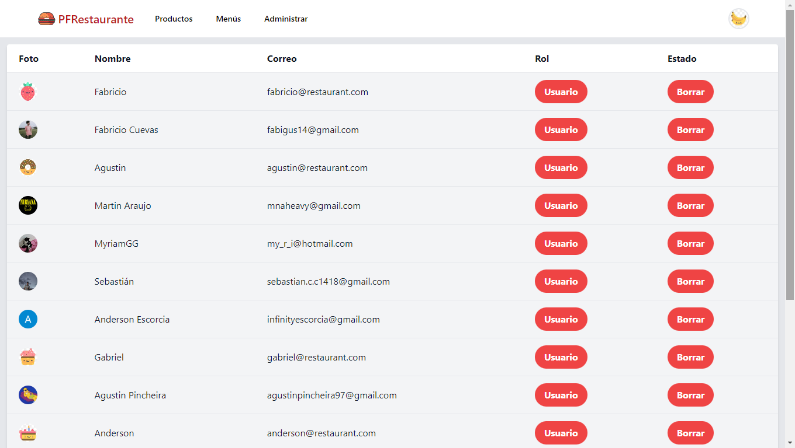

## PFRestaurante
<p align="left">
  
</p>

## Objetivos del Proyecto

- Construir una App utlizando React, Redux, Node y Sequelize.
- Aprender y practicar el workflow de GIT.
- Reservas de mesas de un local de comidas
- Auth de terceros integrada
- Pasarela de pagos
- Filtros combinados
- Cloudinary/upload/bucket
- Notificaciones (mail/socket.io)
- Borrado lógico
- Local storage/persist
- Reviews/puntuación
- Dashboard admin

## Proyecto

El proyecto cuenta con dos carpetas: `api` y `client`. En estas carpetas estará el código del back-end y el front-end respectivamente.

En `api` crear un archivo llamado: `.env` que tenga la siguiente forma:

```
DB_USER=usuariodepostgres
DB_PASSWORD=passwordDePostgres
DB_HOST=localhost
PORT=3001
JWT_SECRET= "SecretKey"
MAIL_USERNAME="MailParaEnviarCorreos"
MAIL_PASSWORD="ContraseñaDelCorreo"
OAUTH_CLIENTID="GoogleClientID"
OAUTH_CLIENT_SECRET="GoogleSecretKey"
OAUTH_REFRESH_TOKEN="TokenRefresh"
STRIPE_PRIVATE_KEY="StripeKey"
```
En `client` crear un archivo llamado: `.env` que tenga la siguiente forma:

```
REACT_APP_CLIENT_ID_GOOGLE="ID_GOOGLE_AUTH"
```

Reemplazar `usuariodepostgres` y `passwordDePostgres` con tus propias credenciales para conectarte a postgres. Este archivo va ser ignorado en la subida a github, ya que contiene información sensible (las credenciales).

Adicionalmente será necesario que creen desde psql una base de datos llamada `restaurant`

El contenido de `client` fue creado usando: Create React App.

## Integrantes del Equipo

• Fabricio Cuevas

• Agustín Pincheira

• Sebastián Carvajal

• Alejandro Javier Ledesma Miño

• Anderson De Jesus Escorcia Hernandez

• Gabriel Hector Cruz Nesteruk

## Problema u oportunidad que resuelve:

Página para un local gastronómico, destinada a la gestión de reservas de mesas realizadas por la clientela. Además el local podrá administrar su menú, pudiendo agregar, modificar o eliminar las comidas del mismo.

Capturas del Proyecto:

<div aling="center">
    
    
    
    
    
    
    
    
    
    
    
    
    
    
    
    
    
</div>